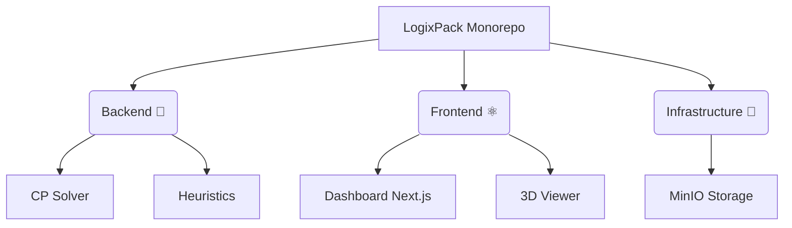

<div align="center">

# 📦 LogixPack

**3D Bin Packing with Delivery Constraints**

[](https://python.org)
[](https://nextjs.org)
[](https://developers.google.com/optimization)

*A full-stack solution to a complex variation of the 3D Bin Packing Problem: allocating items into vehicles in a 3D space, while strictly adhering to a Last-In, First-Out (LIFO) Delivery Order Constraint.*

---

</div>

<br/>

## ✨ Key Features

| 🧠 Advanced Solvers | 💻 Modern Interface | 📊 Integrated Pipeline |
|:---:|:---:|:---:|
| **Constraint Programming (CP)**<br>via Google OR-Tools.<br><br>**Custom Ad-Hoc Heuristics**<br>built from scratch for speed. | **Pristine Web Dashboard**<br>powered by Next.js & Tailwind CSS.<br><br>**3D Visualization**<br>to inspect packed vehicles. | **Local Object Storage**<br>via MinIO for robust data handling.<br><br>**Comprehensive Benchmarks**<br>for evaluating solvers' performance. |

<br/>

## 🏗️ Repository Architecture

The project acts as a monorepo containing three main functional components, built for the EPITA S9 RPC course:



* **[`backend/`](./backend)**: The core calculation engine. Parses problem instances, enforces strict delivery constraints, and manages optimization loops.
* **[`frontend/`](./frontend)**: The web UI. Upload problem definitions, orchestrate solvers directly from your browser, and visually format results.
* **`docker-compose.yml`**: Spins up the local MinIO storage dependency.

<br/>

## 🚀 Quick Start Guide

> [!TIP]
> Ensure you have **Docker**, **Python 3.10+**, and **Node.js 18+** installed before proceeding.

### 1️⃣ Launch Infrastructure

Start the storage layer using Docker:

```bash
docker-compose up -d
```
*MinIO becomes available at `http://localhost:9000` (API) & `http://localhost:9001` (Console).*

### 2️⃣ Initialize the Engine (Backend)

Set up the Python environment containing the solvers:

```bash
cd backend
python3 -m venv .venv
source .venv/bin/activate
pip install -r requirements.txt
```
> 👉 *For manual executions, benchmarking, or Makefile usage, please refer to the **[Backend Documentation](./backend/README.md)***.

### 3️⃣ Start the Interface (Frontend)

Boot up the React web application:

```bash
cd frontend
npm install   # or pnpm / yarn
npm run dev
```
*Navigate to `http://localhost:3000` to interact with the LogixPack dashboard.*

<br/>

## 🧩 The LIFO Constraint Explained

The true complexity of LogixPack lies in the **Delivery Order Constraint**. Items destined for an earlier delivery stop **must not** be physically blocked by items intended for later stops. Imagine unloading a delivery truck: you cannot afford to empty half the truck on the side of the road just to reach a package trapped at the back.

```text
🚚 DOOR [ Stop 1 Items ] 📦 [ Stop 2 Items ] 📦 [ Stop 3 Items ] CABIN
```

### 🛠️ Strategic Approaches Implemented:

1. **Mathematical Certainty (OR-Tools)**: Employs strict integer constraints verifying 3D bounding boxes, rotation states, and topological depth sorting.
2. **Physical Heuristics (Ad-Hoc)**: Mimics gravity and tracks "3D free-spaces" locally, prioritizing inputs dynamically based on delivery stops and item dimensions.

<br/>

<div align="center">

---
*Developed with ❤️ in an academic context at EPITA (S9).*

</div>
